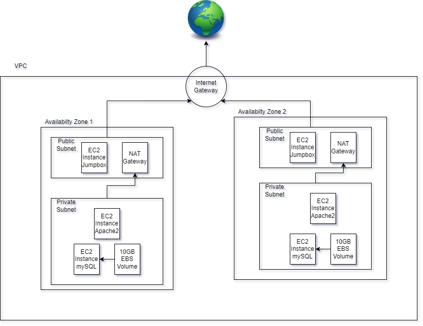

# Assignment 2
## By Shejan Shuza
### Cloud Computing

These 3 files specify an architecture that has 2 subnets in 2 availability zones.

In each availability zone, there is one public and private subnet. 

In the public subnet of each availability zone, which is attached directly to a Internet Gateway, there exists one EC2 instance that is running a Apache2 web server and a NAT Gateway for the private subnet in the availability zone. There is also set up for EIP and Routing Tables within this subnet which is used for effectively routing the public subnet's data.

In the private subnet of each availabilty zone, which is attached to the NAT Gateway of the public subnet, there exists one EC2 instance with a installation of MySQL Server and 10GB of EBS storage attached. 

The idea of the architecture is that the public webserver on each availability zone can get into Database server through the NAT Gateway, and can commit mySQL transactions to the database EC2 instance. 

###Files

- [Network](network.yaml)
- [Servers and security system](server&#32;and&#32;security.yaml")
- [Storage and Database system](storage&#32;and&#32;database.yaml)